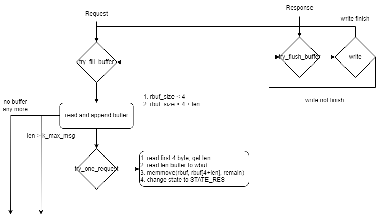

# 非阻塞

有三种解决并发连接的服务端编程方式: 多进程/多线程/事件循环。多进程创建新的进程给每个连接来达到并发；多线程使用线程来替代进程做法；事件循环使用拉取API和非阻塞API，通常运行在单线程中。由于进程和线程带来的大开销(机器配置或者开发难度)，绝大多数现代化的生产级别软件使用事件循环来解决该问题。

非阻塞利用函数`fcntl` 设置flag 为`O_NONBLOCK`，此时file describer 会进入非阻塞状态:

## 设置非阻塞句柄(fd)

```c++
static void fd_set_nb(int fd) {
    errno = 0;
    flags = fcntl(fd, F_GETFL, 0);
    if (errno) {
        die("fcntl error");
        return;
    }
    flags |= O_NONBLOCK;
    errno = 0;
    fcntl(fd, F_SETFL, flags);
    if (errno) {
        die("fcntl error");
    }
}
```

Server Socket / Client Socket 都可以通过此函数设置为`O_NONBLOCK`.

## 使用Poll API

Linux系统相对`poll`的syscall，还有`select`和`epoll`. `select`和`poll`相似，但是`select`允许的最大句柄数被限制得很小，使得`select`在现代慢慢被废弃。`epoll`功能很强大，但是执行相对`poll`更复杂。为了简化开发难度，我们选用`poll`.

伪逻辑代码:

```
main:
    listen(fd, SOMAXCONN)
    fd_set_nb(fd)
    cout << "Listening at port: " << port << endl

    fd2conn = <struct Conn*>[][...] // 保存所有连接对象
    poll_args = <struct pollfd>[][...] // 保存所有句柄
    while true:
        poll_args.clear()
        struct pollfd pfd = {fd, POLLIN, 0}
        poll_args.push_back(pfd)  // 支持一个连接，最后处理
        foreach struct Conn* conn : fd2conn
            if (!conn) continue
            poll_args.push_back({conn->fd, (conn->state == STATE_REQ ? POLLIN : POLLOUT)|POLLERR})
        poll(poll_args.data(), poll_args.size(), 1000) // syscall获取句柄变化
        // read / write 处理
        foreach i = 1; i < (1 - poll_args.size()); i++
            struct pollfd pfd = poll_args[i]
            if (pfd.revents)
                Conn* conn = fd2conn[pfd.fd]
                dosomething_with(conn)
                if (conn->state == STATE_END)
                    delete conn
        // 新连接处理:
        if (poll_args[0].revents)
            do_something_with_new_conn(fd2conn, fd);
```

根据上面的示例代码，我们填充到实现中:

```diff
void start_server(int port) {
    ...
    fd_set_nb(fd);
    cout << "Listening at port: " << port << endl;

    vector<Conn*> fd2conn;
    vector<struct pollfd> poll_args;
    while (true) {
-       struct sockaddr_in client_addr = {};
-       socklen_t socklen = sizeof(client_addr);
-       int connfd = ::accept(fd, (struct sockaddr*)&client_addr, &socklen);
-       if (connfd < 0) {
-           continue;
-       }
-       while (true) {
-           int32_t err = one_request(connfd);
-           if (err) {
-               break;
-           }
-       }
-       close(connfd);
+       poll_args.clear();
+       struct pollfd pfd = {fd, POLLIN, 0};
+       poll_args.push_back(pfd);
+       for (Conn* conn : fd2conn) {
+           if (!conn) {
+               continue;
+           }
+           struct pollfd pfd = {};
+           pfd.fd = conn->fd;
+           pfd.events = (conn->state == STATE_REQ) ? POLLIN : POLLOUT;
+           pfd.events |= POLLERR;
+           poll_args.push_back(pfd);
+       }
+       int rv = poll(poll_args.data(), poll_args.size(), 1000);
+       if (rv < 0) {
+           die("poll");
+       }
+       for (size_t i = 1; i < poll_args.size(); i++) {
+           if (poll_args[i].revents) {
+               Conn* conn = fd2conn[poll_args[i].fd];
+               connection_io(conn);
+               if (conn->state == STATE_END) {
+                   fd2conn[conn->fd] = NULL;
+                   close(conn->fd);
+                   free(conn);
+               }
+           }
+       }
+       if (poll_args[0].revents) {
+           accept_new_conn(fd2conn, fd);
+       }
+   }
}
```

新增处理读写函数:`void(*connection_io)(Conn*)`, 以及处理新连接函数`void(*accept_new_conn)(vector<Conn*>&, int)`.

## 实现连接函数

我们先实现连接函数，该函数accept获得`connfd`(连接的句柄)，对其设置为`O_NONBLOCK`，并且生成新的Conn* 来保存该`connfd`:

```c++
static int32_t accept_new_conn(vector<Conn*>& fd2conn, int fd) {
    struct sockaddr_in client_addr = {};
    socklen_t socklen = sizeof(client_addr);
    int connfd = accept(fd, (struct sockaddr*)&client_addr, &socklen);
    if (connfd < 0) {
        msg("accept() error");
        return -1; // error
    }
    fd_set_nb(connfd);
    Conn* conn = (Conn*)malloc(sizeof(Conn));
    if (!conn) {
        close(connfd);
        return -1;
    }
    conn->fd = connfd;
    conn->state = STATE_REQ;
    conn->rbuf_size = 0;
    conn->wbuf_size = 0;
    conn->wbuf_sent = 0;
    conn_put(fd2conn, conn);
    return 0; // success
}
```

`void(*conn_put)(vector<Conn*>&, Conn*)` scale size of the container by num of the connfd:

```c++
static void conn_put(vector<Conn*>& fd2conn, Conn* conn) {
    if (fd2conn.size() <= (size_t)conn->fd) {
        fd2conn.resize(conn->fd + 1);
    }
    fd2conn[conn->fd] = conn;
}
```

## 实现处理读写函数

`void(*connection_io)(Conn* conn)` 负责区分读和写，具体读写请查看diff:

```c++
static void connection_io(Conn* conn) {
    if (conn->state == STATE_REQ) {
        state_req(conn);
    } else if (conn->state == STATE_RES) {
        state_res(conn);
    } else {
        assert(0); // not expected
    }
}
static void state_req(Conn* conn) {
    while (try_fill_buffer(conn)) {}
}
static void state_res(Conn* conn) {
    while (try_flush_buffer(conn)) {}
}
```

流程图如下:


